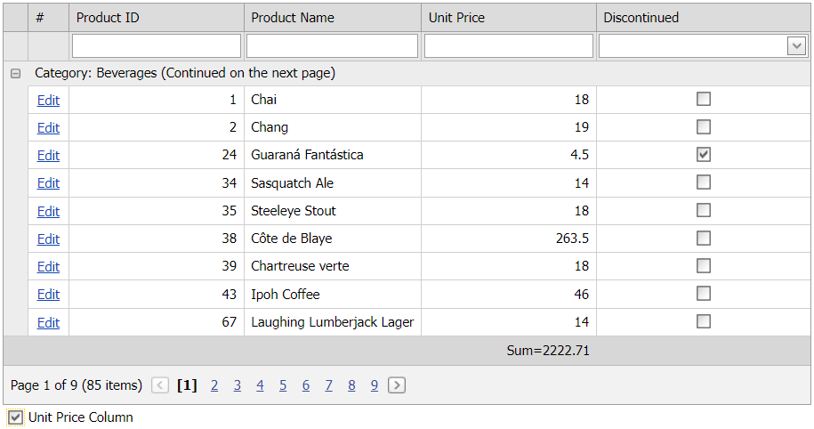

<!-- default badges list -->

[](https://supportcenter.devexpress.com/ticket/details/E4580)
[](https://docs.devexpress.com/GeneralInformation/403183)
[](#does-this-example-address-your-development-requirementsobjectives)
<!-- default badges end -->
# Grid View for ASP.NET Web Forms - How to hide a grid column on the client

This example demonstrates how to change the visibility of the [Grid View](https://docs.devexpress.com/AspNet/5823/components/grid-view)'s [columns](https://docs.devexpress.com/AspNet/3691/components/grid-view/concepts/data-representation-basics/columns) on the client without making a round trip to the server. Check or uncheck the **Unit Price Column** check box to show or hide the **Unit Price** column.



## Overview

Follow the steps below to change a [column](https://docs.devexpress.com/AspNet/3691/components/grid-view/concepts/data-representation-basics/columns)'s visibility on the client.

### 1 Apply a CSS class to all cells of a column

A column can include the following cells:

* [Column Header](https://docs.devexpress.com/AspNet/3669/components/grid-view/visual-elements/column-header)
* [Edit Cell](https://docs.devexpress.com/AspNet/3680/components/grid-view/visual-elements/edit-form)
* [Data Cell](https://docs.devexpress.com/AspNet/3670/components/grid-view/visual-elements/data-cell)
* [Filter Row Cell](https://docs.devexpress.com/AspNet/3684/components/grid-view/visual-elements/filter-row)
* [Footer Cell](https://docs.devexpress.com/AspNet/3683/components/grid-view/visual-elements/footer-cell)
* [Group Footer Cell](https://docs.devexpress.com/AspNet/3815/components/grid-view/visual-elements/group-footer)

Apply your CSS class to the [CssClass](https://docs.microsoft.com/en-us/dotnet/api/system.web.ui.webcontrols.style.cssclass?view=netframework-4.8#System_Web_UI_WebControls_Style_CssClass) property of every cell in a column:

```aspx
<dx:ASPxGridView ID="gvProducts" runat="server" AutoGenerateColumns="False" DataSourceID="dsProducts" KeyFieldName="ProductID">
    <Columns>
        <!-- ... -->
        <dx:GridViewDataTextColumn FieldName="UnitPrice" VisibleIndex="4">
            <HeaderStyle CssClass="unitPriceColumn" />
            <EditCellStyle CssClass="unitPriceColumn" />
            <CellStyle CssClass="unitPriceColumn" />
            <FilterCellStyle CssClass="unitPriceColumn" />
            <FooterCellStyle CssClass="unitPriceColumn" />
            <GroupFooterCellStyle CssClass="unitPriceColumn" />
        </dx:GridViewDataTextColumn>
    </Columns>
</dx:ASPxGridView>
```

### 2 Specify the display property of the CSS class

The [display](http://www.w3schools.com/cssref/pr_class_display.asp) property of the CSS class specifies the display behavior of an element. Set this property to `none` to hide the column or set it to `table-cell` to show the column.

This example uses a jQuery CSS selector to change the [display](http://www.w3schools.com/cssref/pr_class_display.asp) property value.

```javascript
<script type="text/javascript">
    function SetUnitPriceColumnVisibility(visible) {
        unitPriceColumnVisible = visible;
        var disp = visible ? 'table-cell' : 'none';
        $('td.unitPriceColumn').css('display', disp);
    }
</script>
```

<!-- default file list -->

## Files to Look At

* [Default.aspx](./CS/WebSite/Default.aspx) (VB: [Default.aspx](./VB/WebSite/Default.aspx))
* [Default.aspx.cs](./CS/WebSite/Default.aspx.cs) (VB: [Default.aspx.vb](./VB/WebSite/Default.aspx.vb))

<!-- default file list end -->

## Documentation

* [Access Columns](https://docs.devexpress.com/AspNet/3697/components/grid-view/concepts/data-representation-basics/columns/accessing-columns)
* [Grid View Examples](https://docs.devexpress.com/AspNet/3768/components/grid-view/examples)

## More Examples

- [Grid View for ASP.NET Web Forms - How to Display the Grid View in Full Screen Mode (100% Width and Height)](https://github.com/DevExpress-Examples/grid-in-full-screen-mode-in-aspnet-web-applications)
- [Grid View for ASP.NET Web Forms - How to Delete Selected Rows in a Grid](https://github.com/DevExpress-Examples/aspxgridview-delete-selected-rows)
<!-- feedback -->
## Does this example address your development requirements/objectives?

[](https://www.devexpress.com/support/examples/survey.xml?utm_source=github&utm_campaign=asp-net-web-forms-grid-hide-a-column-on-the-client&~~~was_helpful=yes) [](https://www.devexpress.com/support/examples/survey.xml?utm_source=github&utm_campaign=asp-net-web-forms-grid-hide-a-column-on-the-client&~~~was_helpful=no)

(you will be redirected to DevExpress.com to submit your response)
<!-- feedback end -->
